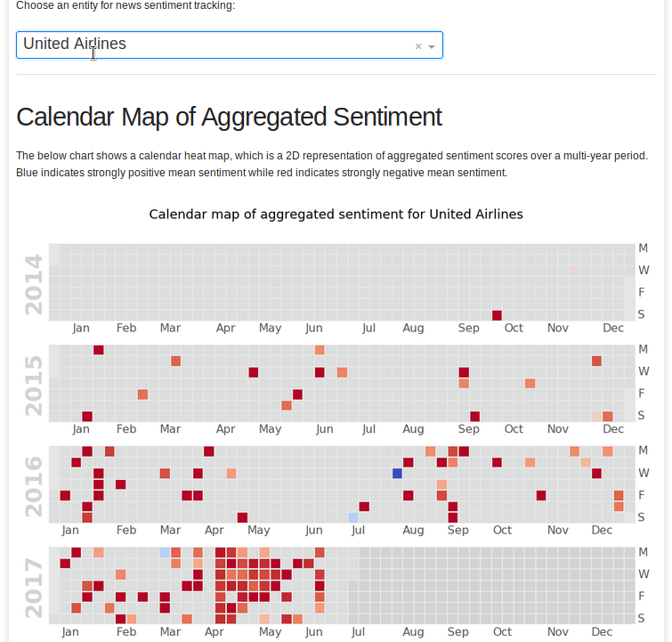
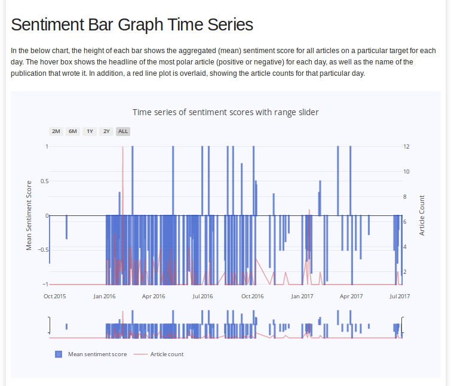
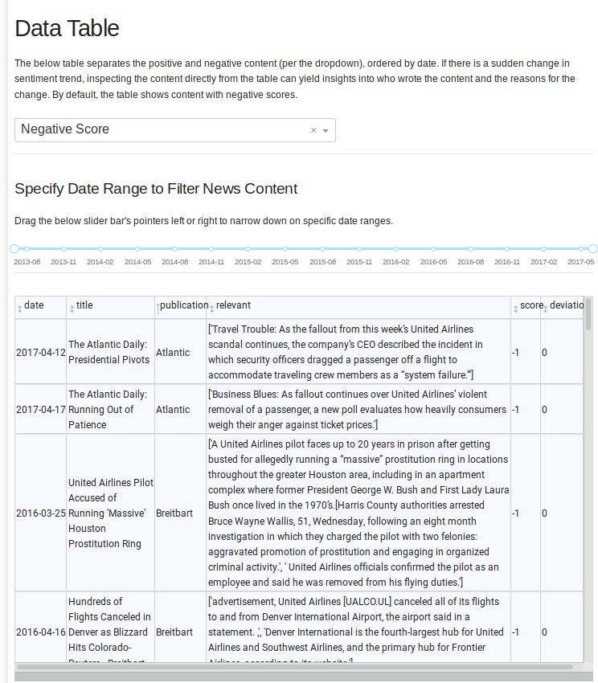

# News Sentiment Tracker
## A Targeted Opinion Mining Interface

In this project, we showcase an end-to-end NLP-based application that automatically detects
fine-grained sentiment towards a specific target query (such as a person, event, product or 
organization) in news articles. We apply novel combinations of techniques from big data, NLP
and time series visualization to provide the end user targeted insights into press coverage on a
specific entity. Our system is shown to identify large-scale shifts in sentiment in news coverage
towards a target reliably, as can be seen in the showcased real-world examples from past events
covered by US news publications. 

## Our Data Product

[See the web-based app on Heroku.](https://nlp-733-dash.herokuapp.com)
Example usage of the web UI is at the bottom of this page. 

## Install modules

First, set up virtual environment and install from ```requirements.txt```:

    python3 -m venv venv
    source venv/bin/activate
    pip3 install -r requirements.txt

For further development, simply activate the existing virtual environment.

    source venv/bin/activate

For tokenization and sentence segmentation, we use the SpaCy library's English language model. 
This must be downloaded manually:

    python3 -m spacy download en

### fastText for Sentiment Analysis

If using [FastText](https://fasttext.cc/) for sentiment analysis, install the Python module from Facebook Research's 
repository using ```pip``` as follows.

    $ git clone https://github.com/facebookresearch/fastText.git
    $ cd fastText
    $ pip3 install .
    
The fastText library can then be imported into Python using the regular command:

    import fastText

### Sentiment Models

The below sentiment classifiers have been implemented thus far. All models were trained on the Yelp 5-class
review dataset. 

 - **TextBlob**: Does not require a trained model (uses the internal "polarity" metric from TextBlob)
 - **fastText**: Requires the 5-classes [fastText trained supervised model](https://fasttext.cc/docs/en/supervised-models.html) 
 (the compressed model already exists in ```./models```)
 - **Flair**: Requires a GPU-enabled machine to run, and a trained Flair classifier model 
(provided at [this GoogleDrive link](https://drive.google.com/open?id=1XQymhmhyXtsU2SawxgzvD5DZocX44JKY)). 
**NOTE** The trained model is 512 MB in size. The same model can be retrained using the code and data provided in 
. We used an NVIDIA P100 GPU with 16 GB of memory for all training experiments. 
 
## Usage

### Run sentiment analysis
 
Run the file ```analysis.py```. An example case for multiple queries using fastText is shown below.
 
    python3 analysis.py --method fasttext --name "United Airlines" "Ryan Lochte"

To use a trained Flair NLP model (in PyTorch format), the ```modelfile``` argument must be passed.

    python3 analysis.py --method flair --name "United Airlines" "Ryan Lochte" --modelfile ./models/final-model.pt
    
Below is a full list of arguments to run the analysis.

    Optional arguments:
    -h, --help            show this help message and exit
    -i INP, --inp INP     Path to news dataset (csv or similar)
    -m METHOD, --method METHOD
                        Sentiment analysis model (textblob, fasttext or flair)
    -n NAME [NAME ...], --name NAME [NAME ...]
                        Name query (e.g. name of a person/organization)
    -f MODELFILE, --modelfile MODELFILE
                        Path to trained classifier model for fasttext or flair
    -r RESULTS, --results RESULTS
                        Path to output result data and plots
    -w WRITE, --write WRITE
                        Boolean flag in ('yes', 'true', 't', 'y', '1') and its
                        correponding negation to choose whether or not to
                        write out image files

## User Interface Demo

Below is some [example usage of our UI](https://nlp-733-dash.herokuapp.com) for specific target queries.

Update the calendar heat maps by selecting targets of interest from the dropdown.


  
Inspect the sentiment over time by zooming in on periods of interest. Hover over the bars to see the article count for the day 
and the most polar headline for that day.



Narrow down on the relevant content about each target by using the time slider bar above the data table. Sort the table by 
publication or sentiment score to track the reasons for a large shift in trends.


